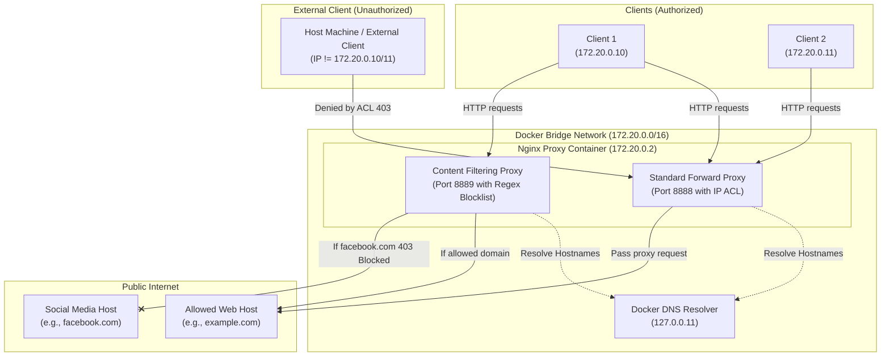

# Nginx Forward Proxy Lab (Advanced)

A containerized Nginx-based Forward Proxy solution demonstrating advanced request intercepting, IP-based access control, content filtering, and dynamic DNS resolution within a Docker network.

This lab shows how a Forward Proxy sits at the edge of a client network to regulate, audit, and filter outgoing traffic to the public internet.

---

## Architecture Overview

The environment is built using Docker Compose and consists of the following components:
1. **Nginx Forward Proxy (`forward-proxy`)**: The core server configured to listen on two separate ports:
   - **Port 8888 (Standard Forward Proxy)**: Validates client IPs against an access control list (ACL) allowing only specific container IPs (`172.20.0.10` and `172.20.0.11`) and rejecting everything else.
   - **Port 8889 (Content Filtering Proxy)**: Dynamically intercepts HTTP requests and blocks blacklisted domains (such as social media and video streaming services) with custom policy violation responses.
2. **Client 1 (`client1` - `172.20.0.10`)**: An Alpine-based container containing curl to simulate an authorized corporate workstation.
3. **Client 2 (`client2` - `172.20.0.11`)**: A second Alpine-based container to simulate another authorized client.
4. **Docker Network (`proxy-network`)**: A dedicated bridge network configured with a static IPv4 subnet (`172.20.0.0/16`) to ensure predictable IP addresses for ACL validation.

### Request Flow and DNS Resolution

In this advanced setup, Nginx uses Docker's built-in DNS server (`127.0.0.11`) dynamically. This configuration allows the proxy to resolve both internal container names (e.g., `client2`) and external web domains (e.g., `example.com`), ensuring high availability and alignment with Docker networking standards.



---

## Project Structure

```
2.ForwardProxy-2/
├── nginx/
│   └── nginx.conf          # Nginx proxy & content filtering server blocks
├── .dockerignore           # Rules to prevent committing local artifacts
├── docker-compose.yml      # Orchestrates proxy and testing client services
└── README.md               # Project documentation (this file)
```

---

## Setup & Usage

### Prerequisites
Make sure you have **Docker** and **Docker Compose** installed on your system.

### Launching the Proxy Environment
Run the following command from the root of this project folder (`2.ForwardProxy-2`) to start the services in detached mode:

```bash
docker compose up -d
```

Verify that all services are running and healthy:
```bash
docker compose ps
```

Expected output:
```
NAME            IMAGE          COMMAND                  SERVICE       STATUS          PORTS
client1         alpine/curl    "/entrypoint.sh slee…"   client1       running   
client2         alpine/curl    "/entrypoint.sh slee…"   client2       running   
forward-proxy   nginx:alpine   "/docker-entrypoint.…"   nginx-proxy   running         0.0.0.0:8888-8889->8888-8889/tcp
```

---

## Testing & Verification

### 1. Verifying ACL Access Rules (Port 8888)

Only `client1` and `client2` (whitelisted IPs) should be allowed to proxy requests.

*   **Test from Whitelisted Client (`client1`):**
    ```bash
    docker compose exec client1 curl -I -x http://172.20.0.2:8888 http://example.com
    ```
    *Expected Response:* `HTTP/1.1 200 OK` (successfully proxied).

*   **Test from Non-Whitelisted Host Machine:**
    ```bash
    curl.exe -I -x http://localhost:8888 http://example.com
    ```
    *Expected Response:* `HTTP/1.1 403 Forbidden` (rejected by Nginx ACL).

*   **Test Internal Name Resolution:**
    ```bash
    docker compose exec client1 curl -I -x http://172.20.0.2:8888 http://client2
    ```
    *Expected Response:* `HTTP/1.1 502 Bad Gateway` (with Nginx logs showing a resolved IP of `172.20.0.11` but `Connection refused` because `client2` isn't running a web server. This confirms internal DNS resolution works).

### 2. Verifying Content Filtering Rules (Port 8889)

Port 8889 implements strict rules to block specific domains (social media, video streaming) using regex patterns, while allowing standard business-related websites.

*   **Requesting an Allowed Domain:**
    ```bash
    docker compose exec client1 curl -I -x http://172.20.0.2:8889 http://example.com
    ```
    *Expected Response:* `HTTP/1.1 200 OK`

*   **Requesting a Blocked Social Media Domain (facebook.com):**
    ```bash
    docker compose exec client1 curl -i -x http://172.20.0.2:8889 http://facebook.com
    ```
    *Expected Response:*
    ```http
    HTTP/1.1 403 Forbidden
    Content-Type: text/plain
    
    Access to social media is blocked by company policy
    ```

*   **Requesting a Blocked Subdomain (sub.facebook.com):**
    ```bash
    docker compose exec client1 curl -i -x http://172.20.0.2:8889 http://sub.facebook.com
    ```
    *Expected Response:* `HTTP/1.1 403 Forbidden` (Access to social media is blocked...).

*   **Requesting a Domain containing the target keyword as a substring (myfacebook.com):**
    ```bash
    docker compose exec client1 curl -i -x http://172.20.0.2:8889 http://myfacebook.com
    ```
    *Expected Response:* `HTTP/1.1 502 Bad Gateway` or `200 OK` (not blocked by Nginx policies since it is a distinct domain).

---

## Tear Down

To stop and remove all container resources, run:
```bash
docker compose down
```
