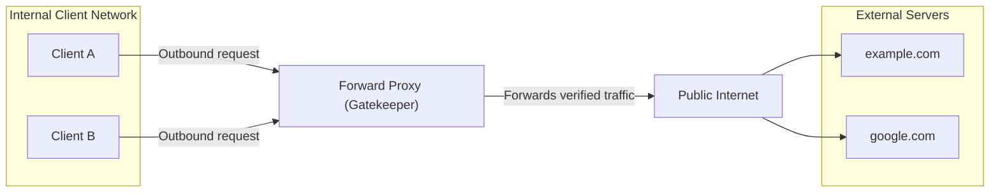
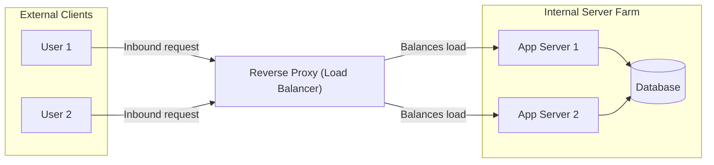

# Educational Tutorial: Nginx Forward Proxy and Content Filtering

Welcome to the Forward Proxy Lab. This tutorial is structured as an academic resource to teach students the core principles of proxy server architecture, transport protocols, IP-based access control, and content-filtering regex rules.

---

## Lesson 1: Understanding Forward Proxies

A Forward Proxy is an intermediary server that acts on behalf of a group of clients (usually located within a private internal network) to manage and regulate their outbound requests to the external internet.

When an internal client requests a resource hosted on the public internet:
1. Instead of establishing a direct connection to the target server, the client sends the outbound traffic to the Forward Proxy.
2. The proxy intercepts the request and evaluates it against set administrative policies (such as domain blocklists, IP whitelists, or content filters).
3. If the request is compliant, the proxy resolves the target server's IP address and forwards the request.
4. The destination server receives the request originating from the proxy server's IP address, masking the internal client's identity.

---

## Lesson 2: Forward Proxy vs. Reverse Proxy

Understanding the distinction between forward and reverse proxies depends on identifying which side of the network connection (client or server) the proxy represents.

### 1. Forward Proxy (Client-Side Proxy)
A Forward Proxy represents the client. It intercepts outbound traffic from a private network to the public internet. The destination server remains unaware of the specific client's IP address.



### 2. Reverse Proxy (Server-Side Proxy)
A Reverse Proxy represents the server farm. It intercepts inbound traffic from the public internet to internal servers. External clients believe they are communicating directly with the primary server, but the Reverse Proxy intercepts requests to handle load balancing, SSL/TLS termination, or caching.



### Key Differences Comparison

| Architectural Dimension | Forward Proxy | Reverse Proxy |
| :--- | :--- | :--- |
| Primary Beneficiary | Clients (protects/controls internal network users) | Servers (protects/accelerates back-end infrastructure) |
| Configuration | Explicitly configured on client browser or system | Transparent to client (client accesses public DNS) |
| Visibility | Hides client IP from external servers | Hides server IPs from external clients |
| Common Uses | Access control, content filtering, employee audit logs | Load balancing, SSL termination, DDoS protection, Web Application Firewalls (WAF) |

---

## Lesson 3: Transport Protocol Mechanics (GET vs. CONNECT)

Forward proxies handle standard HTTP (unencrypted) and HTTPS (encrypted) traffic differently.

### 1. HTTP Forwarding (GET/POST Proxying)
For unencrypted HTTP requests, the proxy can inspect and modify request headers and payloads.
- The client establishes a TCP connection to the proxy port (e.g., 8888).
- The client formats the HTTP request using the absolute URL of the target resource:
  ```http
  GET http://example.com/index.html HTTP/1.1
  Host: example.com
  User-Agent: Client/1.0
  ```
- The proxy parses the absolute URL, verifies that the target domain is permitted, establishes a separate connection to the host, retrieves the content, and passes the HTTP response headers and body back to the client.

### 2. HTTPS Forwarding (CONNECT Tunneling)
For encrypted HTTPS traffic, the proxy cannot decrypt the transmission without dedicated SSL-inspection certificates. Instead, it acts as a blind TCP tunnel using the HTTP CONNECT method.
- The client initiates connection by sending a plain-text CONNECT header to the proxy:
  ```http
  CONNECT example.com:443 HTTP/1.1
  Host: example.com:443
  ```
- The proxy reads the target host (example.com) to evaluate the blocklist.
- If allowed, the proxy establishes a raw TCP socket connection to example.com on port 443.
- The proxy returns a confirmation to the client:
  ```http
  HTTP/1.1 200 Connection Established
  ```
- From this point, the proxy operates as a bi-directional pipe, routing raw TCP bytes back and forth. The TLS handshake and subsequent payload encryption take place directly between the client and target server, keeping the data confidential from the proxy.

---

## Lesson 4: Deep Dive into Nginx Configuration

Let us look at how the configuration in `nginx/nginx.conf` translates into these architectural patterns.

### 1. Internal DNS Resolution (resolver)
```nginx
resolver 127.0.0.11;
```
Inside a Docker bridge network, Nginx must use Docker's internal DNS resolver located at `127.0.0.11`. Using public DNS like `8.8.8.8` prevents Nginx from resolving other containers on the same network (like `client2`) and can cause `502 Bad Gateway` errors.

### 2. IP-Based Access Control List (ACL)
```nginx
allow 172.20.0.10;
allow 172.20.0.11;
deny all;
```
Nginx evaluates access rules sequentially. Requests coming from client containers with whitelisted IPs (`172.20.0.10` and `172.20.0.11`) are allowed, while requests from other IPs (including the host machine gateway `172.20.0.1`) are denied with `403 Forbidden`.

### 3. Boundary-Safe Content Filtering Regex
```nginx
if ($http_host ~* (^|\.)(facebook\.com|twitter\.com|instagram\.com)(:|$)) {
    return 403 "Access to social media is blocked by company policy\n";
}
```
Using boundary-safe matching (`(^|\.)` at the start and `(:|$)` at the end) prevents false positive blocks. Without these boundary markers, a domain like `myfacebook.com` would match `facebook.com` and be blocked incorrectly.

---

## Lesson 5: Student Review Questions & Challenges

### Review Questions
1. Why is it important to use `127.0.0.11` as the DNS resolver when running Nginx as a forward proxy inside a Docker container?
2. Explain the difference in header visibility between proxying an HTTP request (GET) versus an HTTPS request (CONNECT).
3. If an organization wants to log every URL visited by employees, can they do this with a standard CONNECT proxy without decrypting SSL traffic? Why or why not?

### Lab Challenge
Modify the content filtering regex on port 8889 to block gaming domains (such as `steamcommunity.com` and `roblox.com`) while ensuring that informational blogs about these games (like `robloxblog.com`) remain accessible.
